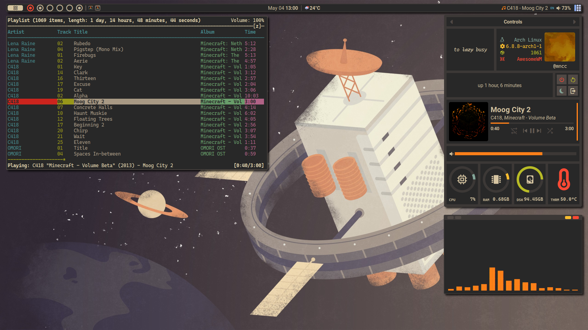

# dotfiles
my _dots_
### Current

## Details
- **Distro**: Arch Linux
- **WM**: awesomewm
- **Compositor**: [picom](https://github.com/yshui/picom)
- **Icons**: [Papirus](https://github.com/PapirusDevelopmentTeam/papirus-icon-theme)
- **Cursor**: [Bibata Modern Classic](https://github.com/ful1e5/Bibata_Cursor)
- **Launcher**: [rofi](https://github.com/davatorium/rofi)
- **Terminal**: [Alacritty](https://github.com/alacritty/alacritty)
- **Shell**: zsh with [Oh my zsh](https://github.com/ohmyzsh/ohmyzsh)

## Dependencies
|package               |  purpose                         |note|
|----------------------|----------------------------------|----|
|awesome-git           |WM                                |    |
|zsh                   |shell                             |    |
|alacritty             |terminal                          |    |
|maim                  |screen shooting                   |    |
|rofi                  |application launcher              |    |
|alsa-utils            |volume control                    |    |
|playerctl             |music control                     |    |
|picom-git             |compositor                        |    |
|ttf-cascadia-mono-nerd|mono font                         |*   |
|ttf-roboto            |system font                       |*   |
|ttf-nerd-fonts-symbols|correctly display nerd font symbol|**  |
|papirus-icon-theme    |icon theme                        |*   |
|bibata-cursor-theme   |cursor theme                      |*   |

_* : optional_  
_**: no need to install if nerd font glyphs is not offset/weird_  
Any packages above can be installed by using any AUR helper  
for example `yay -S awesome-git`
