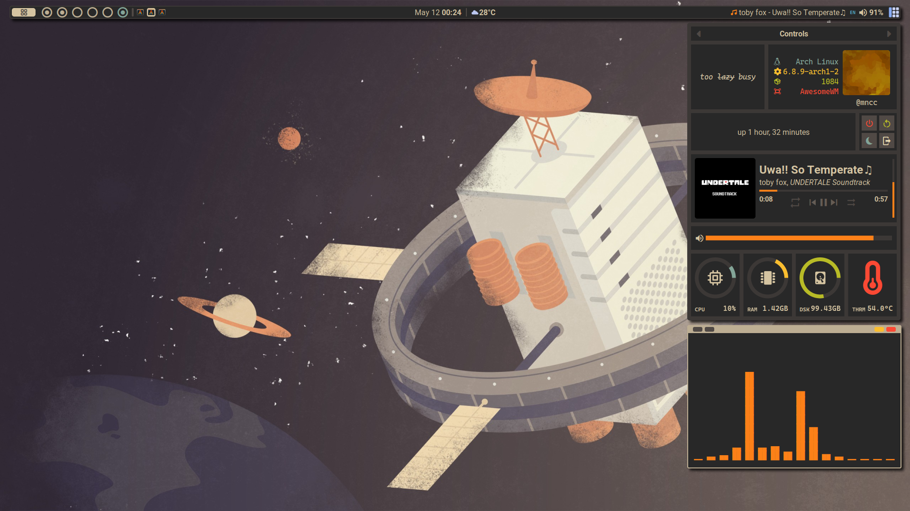

# bloatwaesomewm
my old _awesomewm configs_  
  
i decided that this config is too bloated so i made a [new one](https://github.com/mncc8337/.dotfiles)  

## Dependencies
|package               |purpose                           |note|
|----------------------|----------------------------------|----|
|awesome-git           |WM                                |    |
|alacritty             |terminal                          |    |
|curl                  |fetch weather info                |    |
|maim                  |screen shooting                   |    |
|rofi                  |application launcher              |    |
|alsa-utils            |volume control                    |    |
|playerctl             |music control                     |    |
|picom-git             |compositor                        |    |
|ttf-cascadia-mono-nerd|mono font                         |*   |
|ttf-roboto            |system font                       |*   |
|ttf-nerd-fonts-symbols|correctly display nerd font symbol|**  |
|papirus-icon-theme    |icon theme                        |*   |
|bibata-cursor-theme   |cursor theme                      |*   |

_* : optional_  
_**: no need to install if nerd font glyphs is not offset/weird_  
Any packages above can be installed by using any AUR helper  
for example `yay -S awesome-git`
