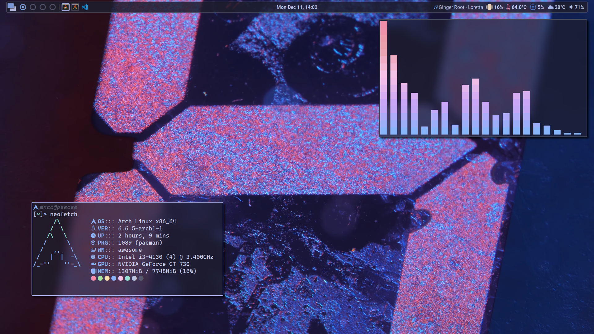
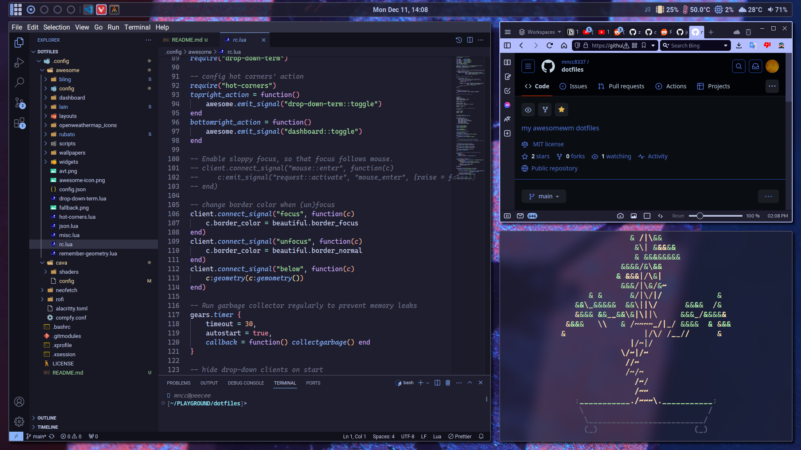

# dotfiles
my dots

## Details
- **Distro**: arch
- **WM**: awesomewm
- **Compositor**: [compfy](https://github.com/allusive-dev/compfy)
- **Icons**: [Papirus](https://github.com/PapirusDevelopmentTeam/papirus-icon-theme)
- **Cursor**: [Bibata Modern Classic](https://github.com/ful1e5/Bibata_Cursor)
- **Launcher**: [rofi](https://github.com/davatorium/rofi)
- **Terminal**: [alacritty](https://github.com/alacritty/alacritty)
- **Shell**: zsh

## Dependencies
|package               |  purpose                         |note|
|----------------------|----------------------------------|----|
|awesome-git           |the WM                            |    |
|zsh                   |the shell                         |    |
|alacritty             |the terminal                      |    |
|maim                  |screen shooting                   |    |
|rofi                  |application launcher              |    |
|cava-git              |audio visualizer                  |*   |
|alsa-utils            |volume control                    |    |
|playerctl             |music control                     |    |
|compfy                |the compositor                    |    |
|terminus-font         |tty font                          |*   |
|ttf-cascadia-code-nerd|mono font                         |*   |
|ttf-roboto            |system font                       |*   |
|ttf-nerd-fonts-symbols|correctly display nerd font symbol|**  |
|papirus-icon-theme    |icon theme                        |*   |
|bibata-cursor-theme   |cursor theme                      |*   |

_* : optional_  
_**: no need to install if your nerd font is working as intended_  
Any packages above can be installed by using any AUR helper  
for example `yay -S awesome-git`

## Screenshots

## TODOS
- [ ] rework on dashboard look
- [ ] make weather tab
